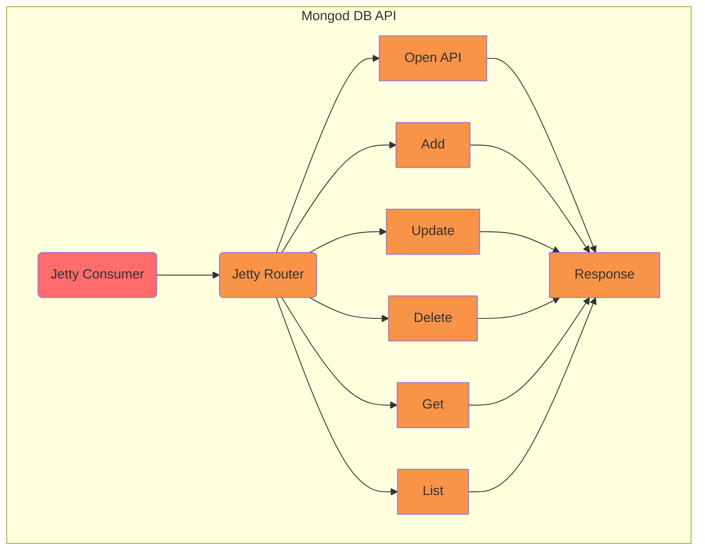

# MongodDB Testing

[](https://github.com/interlok-testing/testing_mongodb/blob/develop/LICENSE)
[](https://github.com/interlok-testing/testing_mongodb/actions/workflows/gradle-build.yml)

Project tests interlok-mongo-db, interlok-varsub, interlok-json features

## What it does

This project has a single workflow that implements a simple rest api to manage (CRUD) data in mongodb.




It's not intended to be a fully working api and a lot of use cases are not handled.

The rest API uses an Open API yaml file to describe its endpoints although not all errors are handled.

## Getting started

Before starting Interlok you need to create a MongoDb docker container with

* `docker-compose up`

Then start Interlok

* `./gradlew clean build`
* `(cd ./build/distribution && java -jar lib/interlok-boot.jar)`

The MongoDB entries will be validated with the following schema:

```
{   
  "$id":"json-schema",
  "$schema":"http://json-schema.org/draft-07/schema#",
  "title":"Account",
  "type":"object",
  "properties":{
    "firstName":{
      "type":"string",
      "description":"The person's first name."
    },
    "lastName":{
      "type":"string",
      "description":"The person's last name."
    },
    "username":{
      "type":"string",
      "description":"The person's username"
    },
    "password":{
      "type":"string",
      "description":"The person's password"
    }
  },
  "required": ["firstName", "lastName", "username", "password"]
}
```

The API is available at `http://localhost:8080/api/mongodb` and the Open API yaml desc at `http://localhost:8080/api/mongodb\openapi.yml`

## Try it

You can call the api with the following curl commands:

### Add an entry

`curl --location --request POST 'http://localhost:8080/api/mongodb' \
--header 'Content-Type: text/plain' \
--data-raw '{
    "username":"username",
    "firstName":"firstName",
    "lastName":"lastName",
    "password":"password"
}'`

### Update an entry

`curl --location --request PUT 'http://localhost:8080/api/mongodb' \
--header 'Content-Type: text/plain' \
--data-raw '{
    "username":"username",
    "firstName":"firstName",
    "lastName":"lastName",
    "password":"password"
}'`


### Delete an entry

`curl --location --request DELETE 'http://localhost:8080/api/mongodb/username'`

### Get an entry

`curl --location --request GET 'http://localhost:8080/api/mongodb/username'`

### List all entries

`curl --location --request GET 'http://localhost:8080/api/mongodb'`

